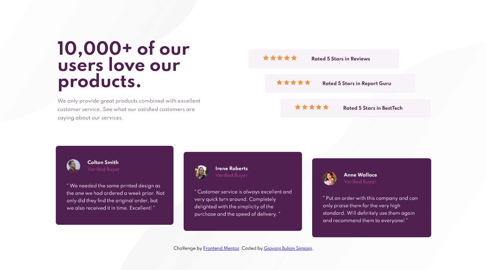

# Frontend Mentor - Social proof section solution

This is a solution to the [Social proof section challenge on Frontend Mentor](https://www.frontendmentor.io/challenges/social-proof-section-6e0qTv_bA). Frontend Mentor challenges help you improve your coding skills by building realistic projects. 

## Screenshot

## Live site URL

 - [https://giovanibulian.github.io/social-proof-section/](https://giovanibulian.github.io/social-proof-section/)

## Built with

- Semantic HTML5 markup
- CSS custom properties
- CSS Grid Layout
- Mobile-first workflow

## Author

- Coded by Me! [GitHub](https://github.com/giovanibulian)